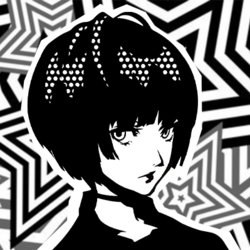

## Death - XIII

  
  

### Tae Takemi
___

#### Confidant Abilities:

| Rank | Ability |
|------|---------|
| 1    | **Rejuvenation**: Increases the selection of healing items at the clinic. |
| 2    | - |
| 3    | **Sterilization**: Adds more healing items to the clinic. |
| 4    | - |
| 5    | **Immunization**: Adds support items to the inventory at the clinic. |
| 6    | - |
| 7    | **Discount**: Decreases the price (-50%) for all items sold at the clinic. |
| 8    | - |
| 9    | - |
| 10   | **Resuscitation**: Increases the selection of revival items at the clinic. |

---

#### Schedule  

**Time of Day**: Daytime  
**Day of Week**: Any Day *(won’t appear after Rank Up for the next 3 days)*  
**Location**: Takemi Clinic in Yongen-Jaya  

---

#### Rank Up Progression  

| Rank | Requirements / Dialogue Choices | Next Pts |
|------|---------------------------------|----------|
| 1    | 1. "Got any 'special' medicine?" 2. Any (8 choices, no effect) 3. "Please go easy on me." (+10)  **Reward:** Guts +1♪ | 0 |
| 2    | Requires **Guts Lv 2 (Bold)**.  1. "I have a bad heart." (+5) 2. "I agree." (+5) 3. (Phone) "I'm totally fine." / "I think I have superpowers." (+5)  **Reward:** Guts +1♪ | 0 |
| 3    | 3. "I don't mind." / "I need the medicine." (+5) 4. (Phone) "Of course not." (+5)  **Reward:** Guts +1♪ | 11 |
| 4    | 1. "Dr. Takemi will help." (+5) 2. "You seem happy." (+10) 3. (Phone) "I'll reflect on my mistakes." (+5)  **Reward:** Guts +1♪ | 20 |
| 5    | 3. "That's good." (+10) 4. (Phone) "About Miwa-chan?" (+5)  **Reward:** Guts +1♪ | 11 |
| 6    | 3. "It suits you." (+10) 4. (Phone) "You can count on me." / "Anything for you." (+5)  **Reward:** Guts +1♪ | 11 |
| 7    | 1. Any (+5) 3. "Just rest for today." / "Anything I can do?" (+5) 4. "We all do sometimes." (+10) / "I’m glad you did." (+5 *Romance Flag*)  **Reward:** Guts +1♪ | 0 |
| 8    | Requires **Charm Lv 4 (Charismatic)** + completion of **Bad Medicine** request (triggered after Rank 7).  1. - 2. "I'm your ally." (+5 *Romance Flag*)  **Actual Rank Up Dialogue:** 2. "Let's get to work, Doctor." (+15) 3. "It's for Miwa-chan." (+15 *Romance Flag*) 4. (Phone) "I'll be cheering you on." / "Anything else I can do?" (+5)  **Reward:** Guts +1♪ | 42 |
| 9    | 1. "It was rough." (+10) 3. "It wanted to see you." (+0) 4. "I love you." (+5)  **Friendship:** "That sounds good." (+0), (Phone) "I'm glad we saw it through." (+5) **Romance:** "It isn't a joke." (+15), (Phone) "So did you." (+5)  **Reward:** Guts +1♪ | 36 |
| 10   | **Friendship** rank up = Daytime **Romance** rank up = Evening | N/A |

---

#### Gift Guide  

| Gift Item      | Confidant Points | Purchase Location | Price |
|----------------|------------------|------------------|-------|
| Heart Ring     | +50 | Jewelry Store, Station Underground Mall, Shibuya | ¥88,000 |
| Mini Cactus    | +50 | Flower Shop, Shinjuku (Night) | ¥1,600 |
| Black Mug      | +50 | General Store, Shinjuku | ¥1,800 |
| 48-Sided Puzzle| +50 | General Store, Shinjuku | ¥3,200 |

___
  

### Bonus Events

**Hangout Inokashira Park** (Requires Death Rank 3 ~ 9)  

- "What's on today's menu?" (+15)

  
**Hangout Tsukishima** (Requires Death Rank 9+ Friendship Only)  

- "Wow. Cooking for me now?" (+15)

