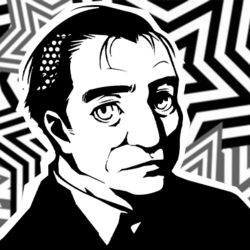

## Sun - XIX

  
  

### Toranosuke Yoshida
___

#### Confidant Abilities:

| Rank | Ability |
|------|---------|
| 1    | - |
| 2    | **Diplomacy**: Occasionally ask for more money or items during negotiations. |
| 3    | **Fundraising**: Allows you to ask for large amounts of money during negotiations. |
| 4    | - |
| 5    | **Manipulation**: Occasionally raises the chances of an enemy giving you a rare item. |
| 6    | - |
| 7    | - |
| 8    | **Mind Control**: Occasionally lets you skip negotiation when attempting to obtain a Persona. |
| 9    | - |
| 10   | **Charismatic Speech**: Allows you to form contracts with higher-level Shadows. |

---

#### Schedule  

**Time of Day**: Evening (Non-rainy)  
**Day of Week**: Sunday (Any Day for Rank 1 Only)  
**Location**: In Front of Shibuya Station Square  
**Rank 10 Deadline**: 11/13  

---

#### Rank Up Progression  

Rank Up is tied to just spending time.  

| Rank | Requirements / Dialogue Choices |
|------|---------------------------------|
| 1    | Requires having done 2 shifts at Beef Bowl Job (Ore no Beko). Requires spending time twice after the 2 shifts. |
| 2    | Charm +2 |
| 3    | - |
| 4    | Charm +2 |
| 5    | Charm +2 |
| 6    | - |
| 7    | Charm +2 |
| 8    | Charm +2 |
| 9    | - |
| 10   | Charm +2 |

