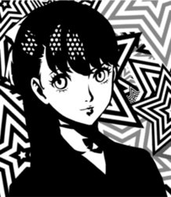

## Faith

  
  

### Kasumi Yoshizawa
___

#### Confidant Abilities:

| Rank | Ability |
|------|---------|
| 1    | - |
| 2    | **Tumbling**: Allows you to avoid being surrounded by enemies in Palaces. |
| 3    | - |
| 4    | **Chaînés Hook**: Allows you to ambush from a distance by attacking with the grappling hook. |
| 5    | **Follow Up**: Chance to perform a follow-up attack if Joker's attack does not down the enemy. **Fitness Talk**: If negotiation with any kind of Shadow fails, you can try again. |
| 6    | - |
| 7    | **Harisen Recovery**: Chance to cure status ailments inflicted upon party members. |
| 8    | **Endure**: Chance to withstand an otherwise fatal attack with 1 HP remaining. |
| 9    | **Protect**: Chance to shield Joker from an otherwise fatal attack. |
| 10   | **Second Awakening**: Evolves Persona. |
| MAX  | **Third Awakening**: Evolves Persona. |
___
#### Schedule  

**Time of Day**: Daytime  
**Day of Week**: Wednesday & Sunday  
**Location**: Kichijoji (Near Entrance)  
*Rank 5 Deadline (12/23)*  
___
#### Rank Up Progression  

| Rank | Requirements / Dialogue Choices | Next Pts |
|------|---------------------------------|----------|
| 1    | (Automatic) 5/30 | 0 |
| 2    | 1. "We're just getting started." / "I'm so done with this." (+5) 2. "Next time, then." (+5) 6. (Phone) "Impressive." (+5) | Max HP +5 / 15 |
| 3    | 1. "Making bento?" (+10) 2. "I'm touched!" / "It looks delicious." (+5) 3. "Is that all for you?" (+10) 4. "It's definitely unique." (+5) 8. "You could try again sometime?" (+15) | Max HP +5 / 51 |
| 4    | 1. "You're looking to buy?" (+5) 2. "A pretty modern look." (+10) 4. "Of course." / "Let's keep going." (+5) 6. "Good choice." (+5) 8. "Everyone deals with that." (+5) 9. "We'll work at it together." (+5) 10. (Phone) "I'm glad to hear that." / "You should be more confident." (+5) | Max HP +5 / 20 |
| 5    | 1. "It's a surprise, yeah." (+5) 3. "Go ahead. I'll watch." (+15) 5. "I saw!" (+15) 6. "That's important." (+15) 8. (Phone) "Gymnastics." (+15) | 0 |
| 6    | Locked until 1/13 (Must have Rank 5). 10. (Phone) "You have to face it." / "So what if it is?" (+5) | Max HP +5 / 0 |
| 7    | 3. "You okay?" (+5) 4. "That isn't true." (+10) 6. "Of course." (+15) 7. (Phone) "I love a good challenge." (+5) | Max HP +5 / 55 |
| 8    | 1. Walk up to Sumire. (+15) 3. "I'm here for you." (+10) 6. Any (+15) 8. "I see..." (+5) 9. "Sounds like progress." (+10) 10. (Phone) "The resale shop." / "Online." (+5) | 40 |
| 9    | 1. Any (+5) 2. Any (+5) 3. "Of course I do." (+5) 4. Any (+10) 5. "Go ahead." (+10)  **Friendship:** "Let's stay friends." (+0) / "You can always rely on me." (+10) / (Phone) "I'm glad to hear that." (+5) **Romance:** "I love you too." (+0) / Any (+5) / Any (+15) / (Phone) "Get used to it." (+5) | 80 |
| 10   | N/A (Locked until 2/2) | MAX |
___
#### Gift Guide  

| Gift Item          | Confidant Points | Purchase Location | Price   |
|--------------------|------------------|------------------|---------|
| Heart Ring         | +50 | Jewelry Store, Station Underground Mall, Shibuya | ¥88,000 |
| Luxury Aroma Set   | +50 | Cosmetic Store, Underground Mall | ¥3,800 |
| Crimson Lipstick   | +50 | Cosmetics Store, Station Underground Mall, Shibuya | ¥6,000 |
| Mini Cactus        | +50 | Flower Shop, Shinjuku at Night | ¥1,600 |
| Bath of Roses      | +50 | Flower Shop, Shinjuku at Night | ¥3,200 |
| Face Beautifier    | +50 | Electronics Superstore, Akihabara | ¥9,800 |
___
### Bonus Events

**Hangout Meiji Shrine** (Requires Faith Rank 5 or below)  

1. "When I have a wish, sure." (+15)

  
**Hangout Inokashira Park** (Requires Faith Rank 5 or below)  

1. "I don't mind." (+15)

  
**Hangout Shinagawa** (Requires Faith Rank 5 or below)  

1. "Yeah." (+15)  
    
2. "Let's see both." (+15)

_Receive Sea Slug Doll_  
  
**Hangout Seaside Park** (Requires Faith Rank 5, Before 12/22)  

1. "I know how you feel." (+15)

  
**Hangout Inokashira Park** (Requires Faith Rank 7+)  

1. "This is easy." (+15)

  
**Hangout Asakusa** (Requires Faith Rank 9+ Friendship Only)  

1. "You don't mind heights?" / "It is quite a view." (+10)

